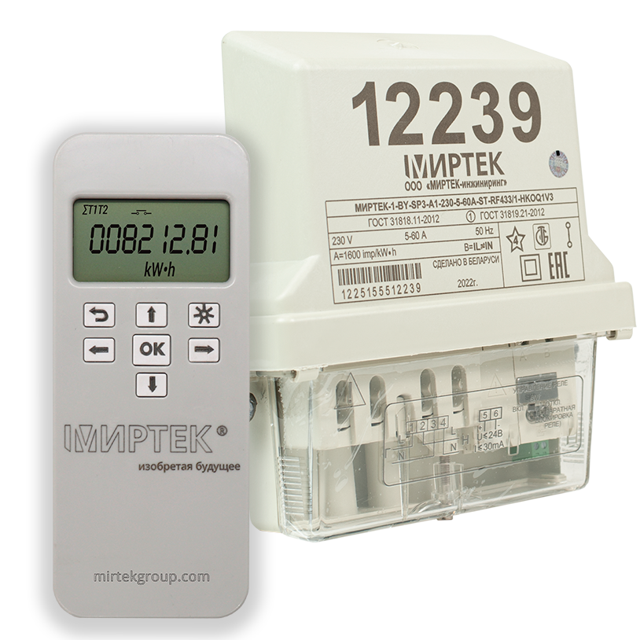

# Mirtek MQTT Gateway

Гейтвей в MQTT для счётчиков Миртек.

* Предоставляет web-ui для конфигурации WiFi, MQTT и айди счётчика.
    * По умолчанию Wifi AP: `MirtekMQTTGateway`/`12345678`.
* Паблишит показания SUM/T1/T2 в топики `mirtek/<id>/SUM`/`mirtek/<id>/T1`/`mirtek/<id>/T2`.

## Железо

`Esp32` как гейтвей и `cc1101` как радиоинтерфейс.
Мощности `cc1101` хватает в притык, рекомендую что-нибудь серьёзнее.

## Референсы

[https://radiokot.ru/forum/viewtopic.php?f=25&t=171991](https://radiokot.ru/forum/viewtopic.php?f=25&t=171991).

